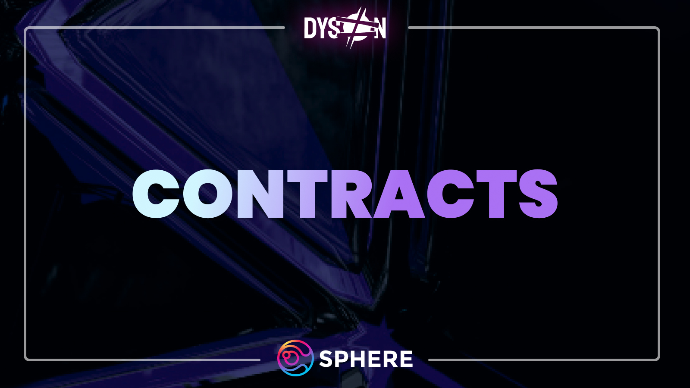

# Contracts

Transparency is key to Dyson. That is why all contracts, from vault to strategy addresses, are available on the dApp.
As well as having our code open for everyone, we have audited our base-strategy vault to ensure maximum security:

Our first audit was completed by Peckshield which can be seen [here](https://github.com/peckshield/publications/blob/master/audit_reports/PeckShield-Audit-Report-Dyson-v1.0.pdf).
As of March 3rd, 2023, Dyson has audited its main codebase for a second time by Prisma Shield. The findings can be found [here](https://prismashield.com/audit/dyson/).

## Dyson-Preon Nebula Vault security

Preon's Nebula Vaults are actively managed by Dyson using ALM Vaults that are battle-tested from Tetu's codebase, which can be checked [here](https://docs.tetu.io/tetu-io/technical/security-overview).
Our ALM Vault's codebase features multiple audits & peer reviews, including internal audits of our own.

## Multisig

There is currently only one Multisig meant for Dyson. Its current purpose is to accumulate fees on Polygon vaults from Dyson to fuel the Sphere Earnings Pool. 

The keyholders of the 4-out-of-9 [Multisig](https://debank.com/profile/0x79e51953f023df68fc46170d1ee47fd5a49d3b6e) are:

|Name | Affiliation            |
|------------|--------------- |
| Simsala |  Sphere Founder |
| Geometrus | Sphere Founder |
| Aqua  | Sphere Team       |
| Rux | Sphere Team |
| Ralph |  Sphere Team |
| Kato | Sphere Community |
| DeFi Moonbird | Sphere Community |
| Figue | Paladin |
| Kila | Retro / Stabl Labs |
