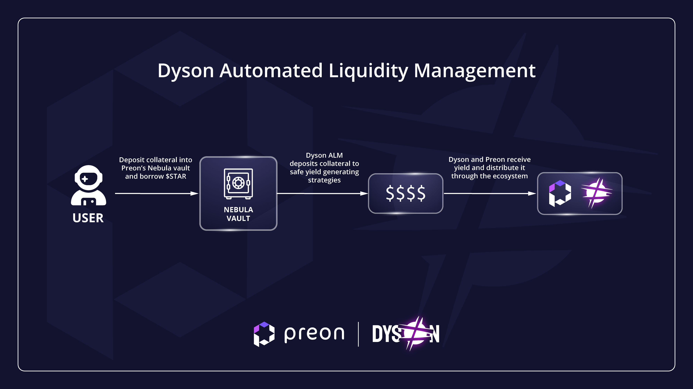

# Automated Liquidity Management 

## What is an ALM?

In addition to being the yield maximizer protocol of the Sphere ecosystem, Dyson also serves as an ALM (Automated Liquidity Management) protocol for Preon Finance. An ALM (Automated Liquidity Manager) is a type of vault where an external protocol’s vaults (e.g. [Preon’s Nebula vaults](https://www.preon.finance/) are automatically managed by an underlying strategy to generate yield.

## What is an ALM’s function?

Dyson creates strategies that manage an external protocol’s vaults. These strategies optimize yield, thus mutually aligning benefits between the protocols. Integrating an ALM leads to a higher TVL which, in turn, brings more revenue to both protocols, benefiting users through revenue sharing mechanics.

## Dyson-Preon Synergy

Preon Finance, a 0%-interest CDP protocol, generates revenue through borrow fees. Under certain market conditions, closing loans may be unfavorable, thereby reducing protocol revenue generation. To learn more about Preon, explore the documentation [here](https://docs.preon.finance/docs/intro).
Dyson serves as the ALM protocol for Preon Finance. This benefits Preon by facilitating revenue generation regardless of market conditions.

Example:

Users deposit collateral into a Nebula vault on Preon.
Dyson then automatically deposits the collateral into safe yield generating strategies.
Deposited assets earn yield.
Earned yield is distributed to Preon.

 