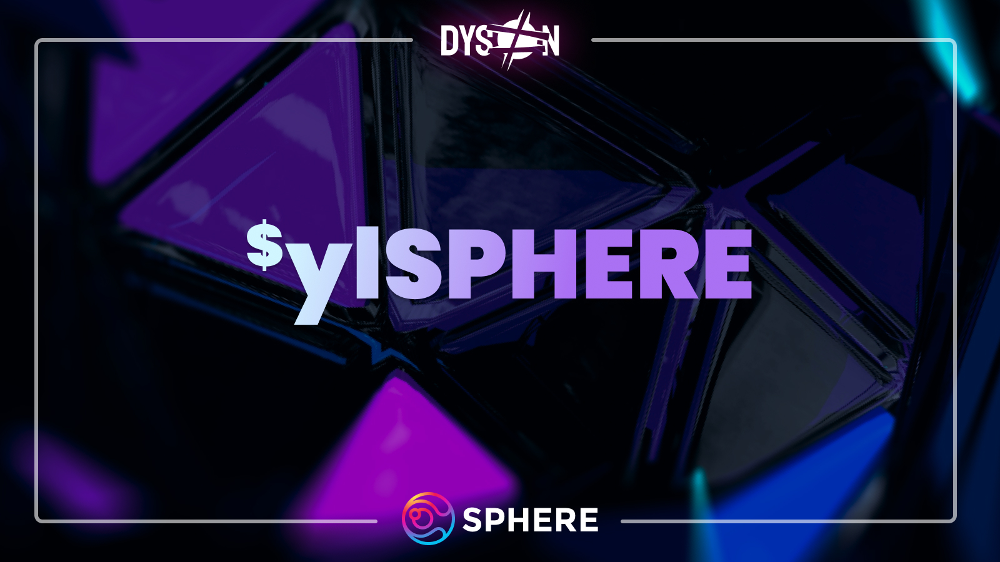

# Sphere Earnings Pool

The Sphere Earnings Pool is a single-sided Dyson vault in which $SPHERE lockers earn real yield from Dyson’s performance fees, a portion of the Sphere Finance Treasury’s yield, and all future Sphere Finance ecosystem protocol revenue.

## How does the Sphere Earnings Pool work?

The Sphere Earnings Pool is a vault which locks users’ $SPHERE tokens for a 17-week period. They are then given $ylSPHERE (yield-locked SPHERE), a Sphere Earnings Pool proof-of-deposit token. From then on, depositors earn a variable APR of real yield. The yield is fueled by Dyson's performance fees and Sphere Finance Treasury yield strategies, and is currently distributed in $wPOL. In the future, yield will also be distributed in Preon’s $STAR stablecoin thanks to the Sphere Finance Treasury’s allocation of $vePREON.

## How frequent are rewards?

Rewards are distributed on a 7-day cycle. At the end of each cycle, the vault will **temporarily** stop distributing rewards until it is refilled. At that time, the multisig team will promptly refill the vault and initiate a new 7-day cycle. Due to the current vault structure, it cannot be pre-filled, but this process will be enhanced with an upcoming tokenomics upgrade to improve the overall flow and increase decentralization.

