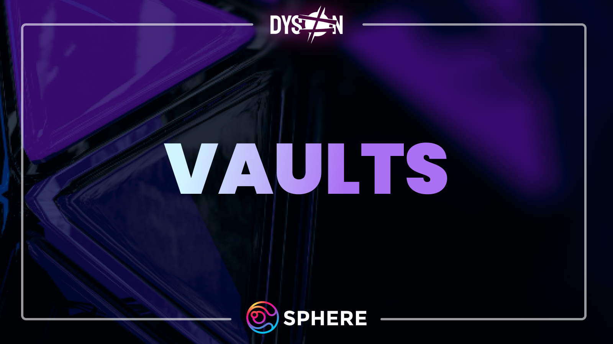

# Vaults

Vaults are the core smart contracts that automate the yield farming process. A vault can harvest, sell, and compound yield incentives. This has the effect of achieving a higher yield over time, turning the farming APR (annual percentage return) into an APY (annual percentage yield).

## Why use a Dyson vault?

Vaults are time- and gas-efficient. Instead of checking your position to compound your rewards, the vault harvests rewards and compounds them automatically. Since the vault itself manages the funds, depositors do not pay gas to compound their yield farming positions.

An example:

A user wants to deposit Aerodrome $STAR/$USDC LP.
If they decide to deposit in Dyson's $STAR/$USDC LP vault, the rewards are automatically compounded into more $STAR/$USDC LP
This has the effect of growing the share of the depositor's LP, which grows their share of rewards over time

Vaults do not lock users’ token(s) unless the user is depositing in a strategy in which the underlying protocol's farming mechanics require a lock (such as the Sphere Earnings Pool). When users deposit into Dyson, they receive a *dyson-prefixed token*.

## What are dysontokens?

A dysontoken (or dyson-prefixed token) is simply a proof-of-deposit receipt token which users can use to withdraw their assets from Dyson's vaults. As well as acting as a receipt token for users, it enables the possibility of protocols using Dyson vaults in their strategies. It is important to note that dysontokens are transferable but not tradable. 

Every dyson-prefixed token is unique. There is only 1 dysontoken per vault, which means depositors hold a share of the dysontoken. All dysontokens are made yield-bearing through compounding and yield-farming the assets deposited.

