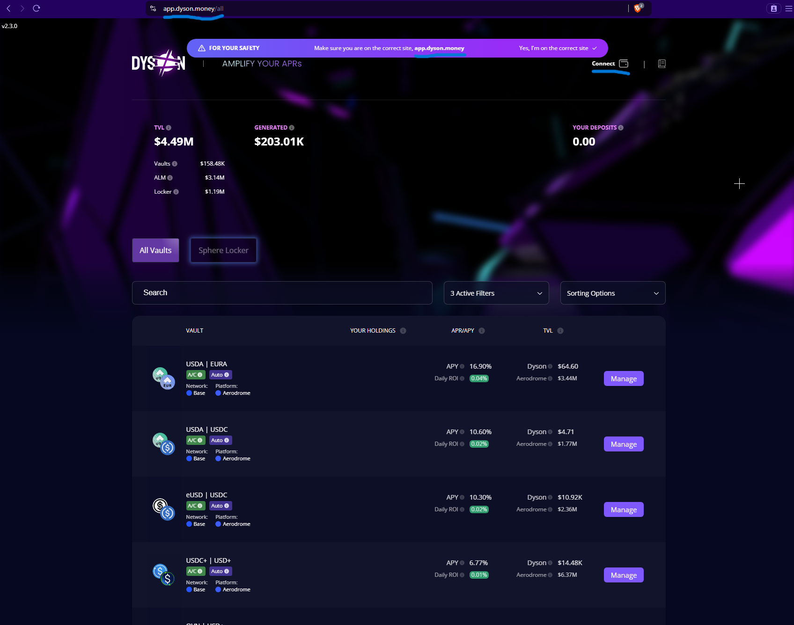
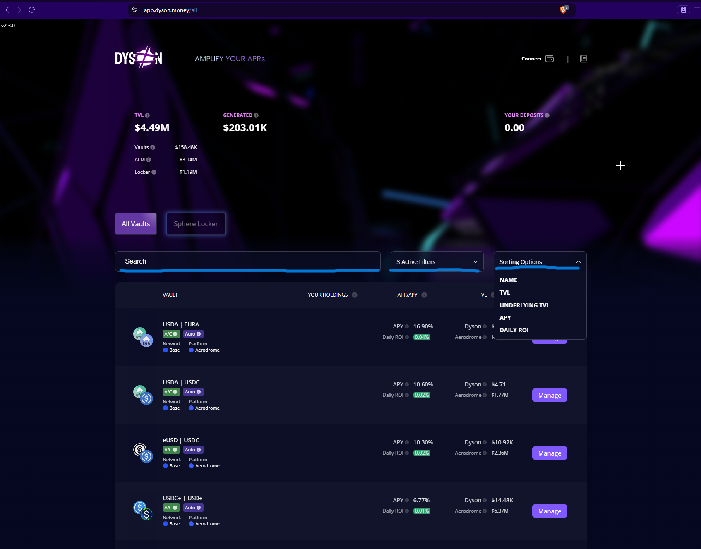
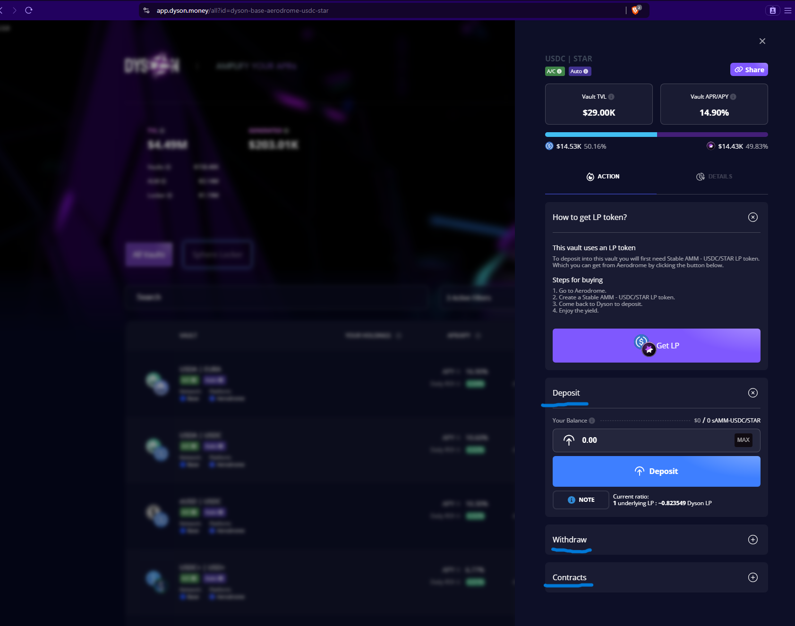
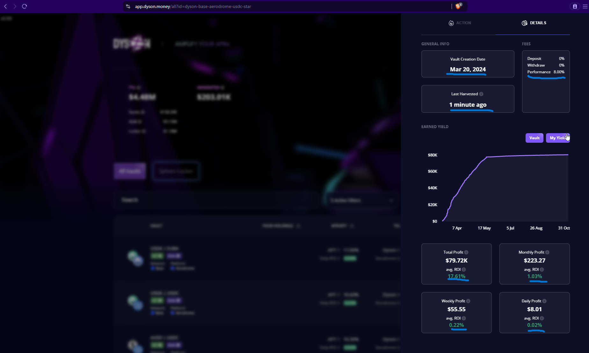
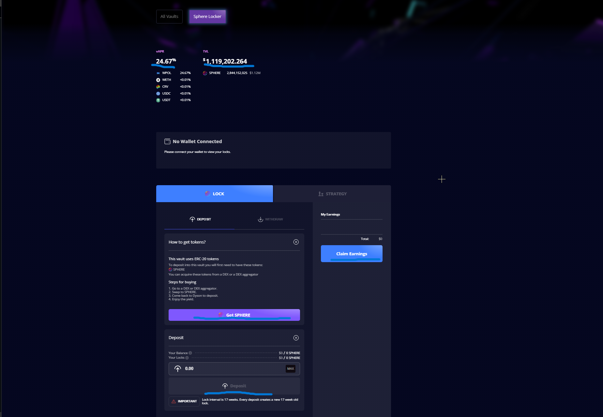

import ReactPlayer from "react-player"

# How to use Dyson

Here is a beginner-friendly video walkthrough:

<ReactPlayer url='https://www.youtube.com/watch?v=nHTpi55bg-Q' controls />

### How do I connect my wallet?

Go to our [dapp](https://app.dyson.money) and confirm the URL shown in our safety banner matches the URL you are using. Once you confirm, simply click the “Connect Wallet” button in the top right corner of the dapp.
 

From there, choose your preferred wallet. You’re now connected and can explore our vaults.

### What information does the dapp show?

The Dyson dapp shows:

- TVL (Total Value Locked): The total amount of $ deposited into Dyson’s vaults.
- Vaults: The amount of TVL that pertains to Dyson’s vaults, listed in “All Vaults”.
- ALM (Active Liquidity Manager): The amount of TVL managed by Dyson’s ALM vaults, for example Preon’s Nebula vaults (tag Preon).
- Locker : The amount of TVL deposited into the ylSPHERE locker.
- Generated: Total profits generated by Dyson since March 13th 2024.
- Your Deposits: Shows the $ value of assets you’ve deposited into Dyson.

### Dyson has two primary menus: All Vaults & Sphere Locker.

All Vaults: Shows all the vaults available on Dyson for depositing
Sphere Locker: Shows the Sphere locker for users who want to lock their SPHERE.

The “All Vaults” menu has a search bar, a filters menu and a sorting options menu.

- Search bar: Allows for users to search specific vaults.
- Filters Menu: The filtering options allow for filtering of networks, assets, and platforms.
- Sorting options menu: Gives the option to sort by Name, TVL, Underlying TVL, APY, and Daily ROI.

### What information do vaults show?

- Underlying liquidity pair
- Network & Platform
- Strategy Information
- Auto-compounding status
- APY
- Daily ROI
- TVL
- Underlying Platform TVL
- Your Holdings (if you have deposited into Dyson and/or have tokens that can be deposited into Dyson’s vaults.)

*The APY’s shown already account for Dyson’s performance fees.

Clicking the Manage button offers more information such as:

- How to get the LP token required for depositing
- A deposit tab: Lets you deposit into the chosen vault.
- A withdrawal tab: Lets you withdraw your deposited assets.
- A contracts tab: Shows important contract information pertaining to the vault chosen.

What metrics do Dyson’s vaults offer?

Dyson offers significant user metrics in an easily digestible fashion.
To access these metrics:
Click the “manage button” on the vault you’re interested in.
Click the details tab
Explore the metrics shown.

The metrics shown consist of:
- Vault creation date
- Last harvested date
- Fees charged
- Earned yield for the vault and your deposit's yield (if applicable)
- Total vault profit
- Monthly profit
- Weekly profit
- Daily profit
- Average ROI
- Historical data on TVL, APY, and Price.
- APY at lowest and highest TVL
- Your transaction history (if applicable)

What is the Sphere Locker?

The Sphere locker is the vault $SPHERE holders lock into to earn real yield.
This yield is variable due to yield coming from revenue sources.
Each lock is for 17 weeks

The Sphere locker  “Lock” page shows:

- Current vAPR
- Sphere locker TVL
- Your locks (if applicable)
- Your earnings (if applicable)
- How to buy SPHERE
- A deposit tab
- A withdrawal tab
- Claim earnings button

The Strategy page shows:

- How the strategy works
- Smart contracts pertaining to the vault

This is a basic walkthrough of Dyson, if you have any questions. Join our [discord](https://discord.com/invite/spheredefi), our team will gladly answer them.
