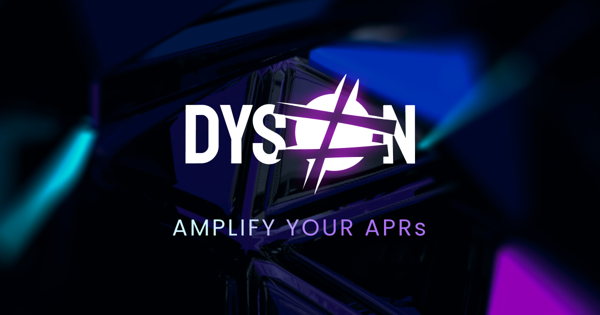

# Overview

# What is Dyson?

​
[Dyson](https://www.dyson.money/) is a decentralized multichain yield maximizer and ALM (Automated Liquidity Manager). Dyson maximizes yield through carefully crafted strategies managed on-chain, making perpetual yield farming accessible to the average user. It also automates the collateral farming for [Preon Finance’s Nebula vaults](https://docs.preon.finance/docs/Understanding%20Preon/Nebula%20Vaults%20&%20Collateral) to optimize Preon’s efficiency and yield.

Every strategy is secured and automated by smart contracts. Dyson automatically harvests and reinvests yield rewards to ensure compounding incentives to depositors. The vaults created for Dyson's strategies are completely permissionless and trustless, meaning that users are  in total control of their assets, and can withdraw at any time they like.  

Dyson was created by [Sphere Finance](https://www.sphere.finance/). The project is currently under the umbrella of [Sphere Finance](https://www.sphere.finance/) products, and is a protocol within the Sphere ecosystem.

## What makes Dyson unique?

In addition to its yield maximizing and auto-compounding capabilities, Dyson is unique because of its Automated Liquidity Management technology. Dyson’s ALM technology gives protocols using its infrastructure (e.g. [Preon Finance](https://www.preon.finance/)) the ability to rehypothecate Nebula vault liquidity to safe yield generating strategies to improve capital efficiency and generate yield for both Dyson and Preon.

